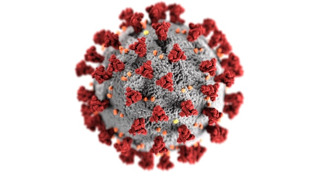

# Sheldon Kappel Data Analyst Portfolio

Python and SQL

## [COVID Data Exploration in SQL](https://github.com/sheldonkappel/COVID_data_exploration)
* bullet 1
* bullet 2

## [Chess Games Mini Analysis in Python](https://github.com/sheldonkappel/chess_mini_analysis)
* bullet 1
* bullet 2

## [Nashville Housing Data Cleaning in SQL](https://github.com/sheldonkappel/nashville_housing_data_cleaning/tree/main)
* bullet 1
* bullet 2

## [Time Series Analysis for Number of Sunspots in R (School Project)](https://github.com/sheldonkappel/sunspots_time_series_analysis)
* bullet 1
* bullet 2

## [Analysis of Car Accidents in the US in Python](https://github.com/sheldonkappel/us_car_accidents_mini_analysis)
*
*
